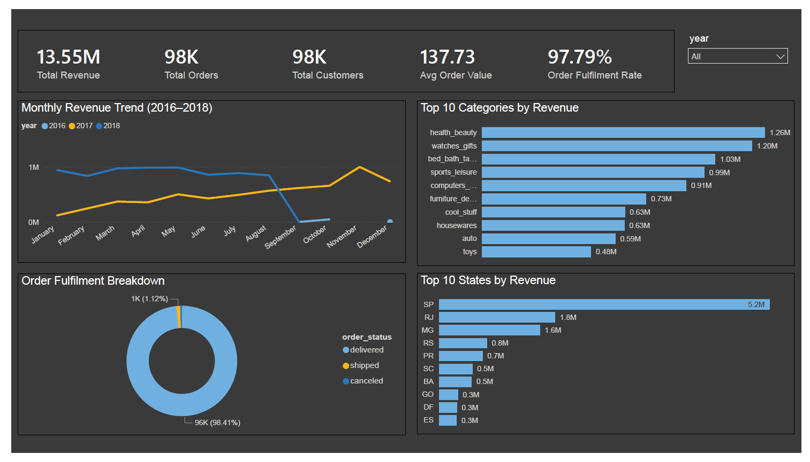
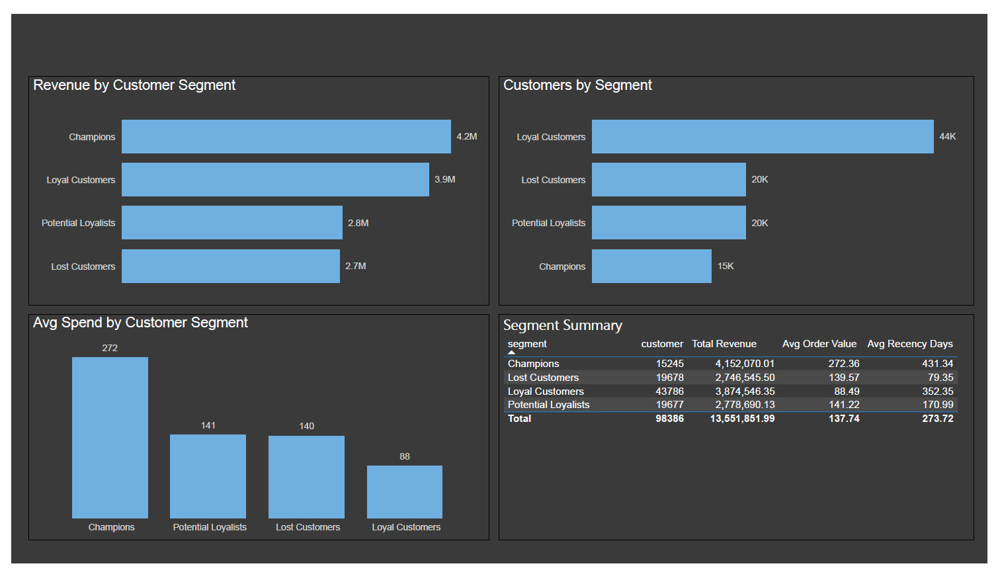
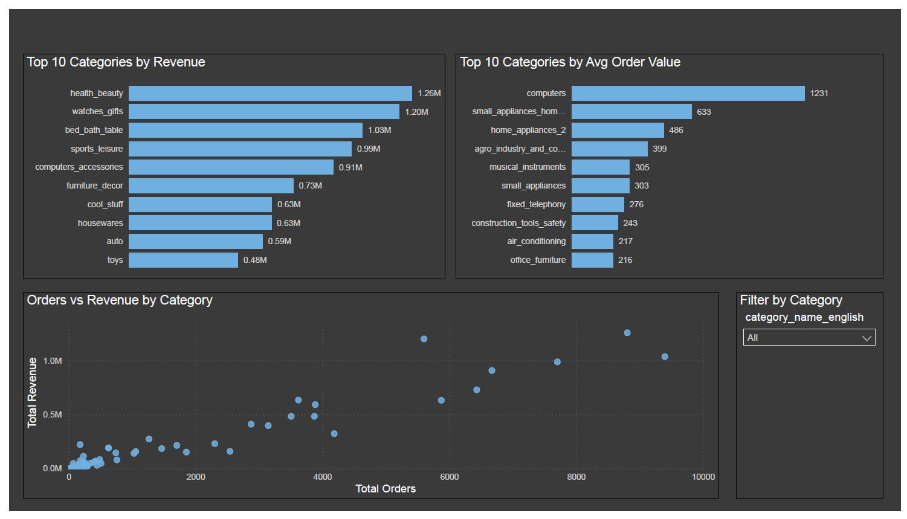

## An end-to-end SQL + Power BI analytics project



---

## Project Overview

This project delivers a full retail analytics solution built on the 
Olist Brazilian E-Commerce dataset — 100,000+ real orders spanning 
2016 to 2018. The goal was to move beyond surface-level reporting and 
answer the questions that actually drive business decisions:

- Which customer segments generate the most revenue — and which are 
  at risk of being lost?
- How has monthly revenue trended, and what does year-over-year 
  growth look like?
- Which product categories deliver the highest value, and which rely 
  on volume over premium pricing?

The project combines a production-style SQL Server data warehouse with 
a three-page Power BI dashboard, documented end-to-end.

---

## Technical Stack

| Layer | Tool |
|---|---|
| Database | Microsoft SQL Server |
| Data modelling | Star schema (fact + 5 dimensions) |
| Analysis | Advanced SQL (window functions, CTEs, RFM) |
| Visualisation | Power BI Desktop |
| Documentation | GitHub |

---

## Data Architecture

The raw Olist dataset (9 CSV files) was transformed into a clean star 
schema with one central fact table and five dimension tables.

### Star schema
```
fact_orders (112,348 rows)
├── dim_customer   (99,441 rows)
├── dim_product    (32,951 rows)
├── dim_seller     (3,095 rows)
├── dim_date       (634 rows)
└── dim_geography  (19,015 rows)
...
```
### Key design decisions

- `fact_orders` uses a composite primary key (`order_id` + 
  `order_item_id`) to correctly handle multi-item orders rather than 
  collapsing them into a single row
- `dim_geography` is separated from `dim_customer` to allow 
  independent geographic analysis independent of customer segmentation
- `dim_date` is a purpose-built date dimension enabling quarter, week, 
  and month-name slicing without runtime calculation
- All raw data lands in staging tables first before transformation into 
  the star schema — standard practice for maintainable data pipelines

---

## SQL Analysis Scripts

| Script | Techniques | Business question answered |
|---|---|---|
| `06_revenue_trends.sql` | CTEs, LAG, window functions, cumulative totals | How is revenue trending month over month? |
| `07_cohort_analysis.sql` | Multi-level CTEs, DATEDIFF, retention logic | What percentage of customers return after their first purchase? |
| `08_rfm_segmentation.sql` | NTILE, CASE, customer scoring | Which customers are champions, loyal, at risk, or lost? |
| `09_product_performance.sql` | DENSE_RANK, multiple simultaneous rankings, Pareto analysis | Which categories drive 80% of revenue? |

---

## Key Findings

### Revenue trends
- The business grew from $267 in September 2016 to over $1M monthly 
  by mid-2018 — a remarkable growth trajectory
- A 9,966% spike in October 2016 (from 3 to 302 orders) marks the 
  likely platform launch or first major marketing push
- Revenue peaked in November 2017 at $1.16M before stabilising in 
  2018 — suggesting market maturation

### Customer segmentation (RFM analysis)
- **Champions** (15,245 customers) — highest avg spend at $272 per 
  order, contributing $4.15M total revenue. However their last 
  purchase was 431 days ago on average — a re-engagement opportunity
- **Loyal Customers** (43,786 customers) — largest segment by volume, 
  $3.87M revenue, but avg spend of only $88 suggests price-sensitive 
  buyers
- **Potential Loyalists** (19,677 customers) — most recently active 
  at 170 days avg recency. Prime targets for conversion to loyal 
  status through targeted promotions
- **Lost Customers** (19,678 customers) — lowest avg spend and 
  longest since last purchase. Reactivation cost likely exceeds value

### Product performance
- **health_beauty** leads on total revenue ($1.26M) driven by high 
  order volume — a mass-market category
- **computers** commands the highest avg order value at $1,231 — 
  low volume, high margin premium category
- **watches_gifts** ranks second in total revenue ($1.20M) with 
  $200 avg order value — strong balance of volume and value
- The top 10 categories account for 62% of total revenue — 
  consistent with Pareto distribution

### Platform insight
- Cohort analysis reveals near-zero repeat purchase rates across all 
  cohorts — Olist operates as a first-time buyer platform
- This makes customer acquisition efficiency the primary growth lever, 
  not retention — a finding with direct strategic implications

---

## Dashboard Pages

### Page 1 — Executive Overview

High-level KPIs, monthly revenue trend by year, top 10 categories, 
order fulfilment breakdown, and revenue by state. Interactive year 
slicer filters all visuals simultaneously.

### Page 2 — Customer Segments

RFM segmentation breakdown showing revenue contribution, customer 
count, and avg spend per segment. Segment summary table provides 
a complete view of each cohort's value to the business.

### Page 3 — Product Performance

Top 10 categories by total revenue and avg order value side by side. 
Scatter plot reveals volume vs value positioning across all categories. 
Category slicer enables drill-down analysis.

---

## Repository Structure

├── 00_create_database.sql
├── 01_create_schema.sql
├── 02_create_staging_tables.sql
├── 03_load_staging_tables.sql
├── 04_load_dimensions.sql
├── 05_load_fact.sql
├── 06_revenue_trends.sql
├── 07_cohort_analysis.sql
├── 08_rfm_segmentation.sql
├── 09_product_performance.sql
├── dashboard_page1.png
├── dashboard_page2.png
├── dashboard_page3.png
└── README.md
...
```


## How to Reproduce

1. Download the Olist dataset from 
   [Kaggle](https://www.kaggle.com/datasets/olistbr/brazilian-ecommerce)
2. Run scripts `00` through `05` in sequence in SQL Server Management 
   Studio against a SQL Server or SQL Server Express instance
3. Run scripts `06` through `09` for the analysis layer
4. Open Power BI Desktop and connect to `OlistRetailDW` on your local 
   SQL Server instance
5. Load all six tables plus `vw_rfm_segments` view and build 
   relationships as documented in the data architecture section

---

## About

**Lawal Faruq Damilola** — Senior Data Analyst  
Portfolio: [lawal-faruq.github.io](https://lawal-faruq.github.io)  
GitHub: [github.com/Lawal-faruq](https://github.com/Lawal-faruq)
